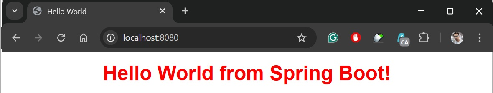
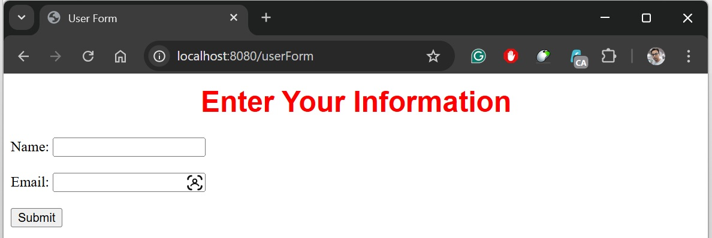
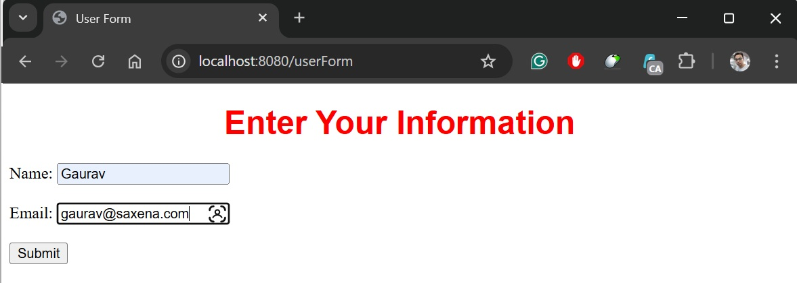
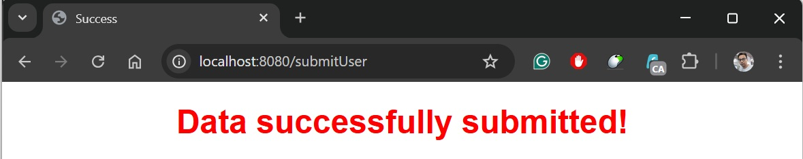
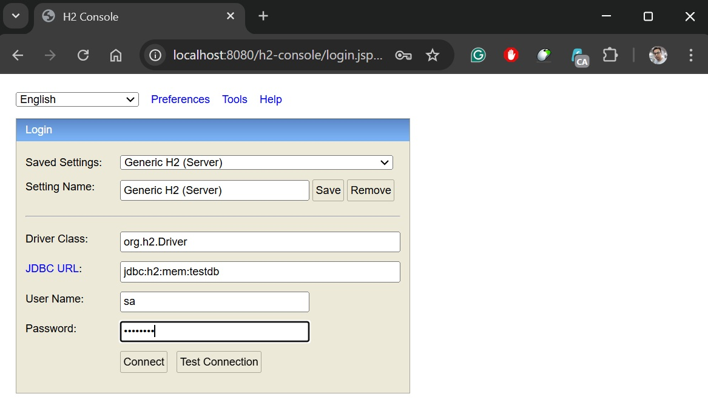
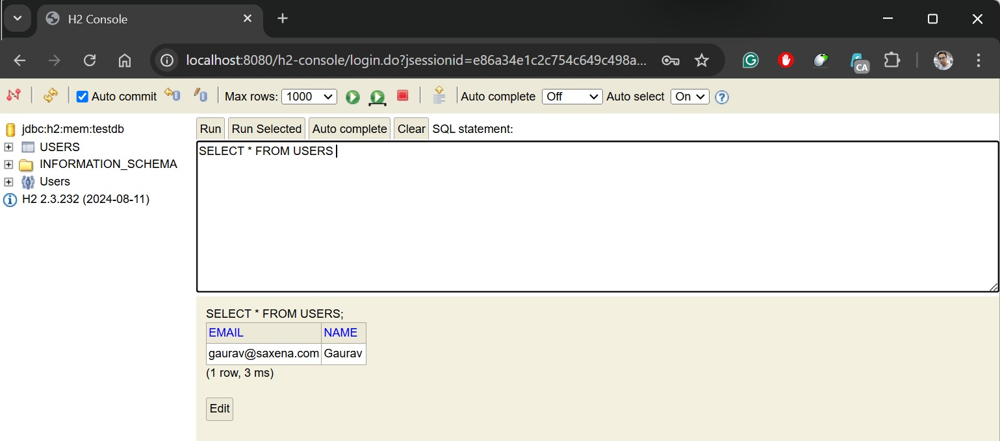

# User Management Application - Spring Boot + JSP + CSS + H2 - Demo Application for FORM submission

## Overview
In this project we created a simple Spring Boot Application with few JSP pages.
you will be asked for your NAME & EMAIL and on submission it will be stored in In-Memory DB (H2 DB)

### Features

- Displays a "Hello World" page.
- Provides a user input form.
- Saves user data to an in-memory database.
- Displays a success page upon form submission.

### Project Structure

    ├── src/main/java/com/example/jsp/form
    │   ├── controller
    │   │   ├── UserController.java
    │   ├── model
    │   │   ├── User.java
    │   ├── repository
    │   │   ├── UserRepository.java
    │   ├── Application
    ├── src/main/webapp/WEB_INF/views
    │   ├── hello.html
    │   ├── userForm.html
    │   ├── userSuccess.html
    │── src/main/webapp/css
    │   ├── styles.css
    ├── pom.xml (Maven Dependencies)

## Endpoints

| Method | Endpoint      | Description                                 |
| ------ | ------------- | ------------------------------------------- |
| GET    | `/`           | Displays "Hello World" page                 |
| GET    | `/userForm`   | Shows the user input form                   |
| POST   | `/submitUser` | Handles form submission and saves user data |

## Setup and Running the Application

### Prerequisites

- Java 17+
- Maven

## Running the Project

Once the application is up and running, below three URLs will be available, try to hit them one by one.

    http://localhost:8080/

    http://localhost:8080/userForm

    http://localhost:8080/submitUser

## Example Screenshots

